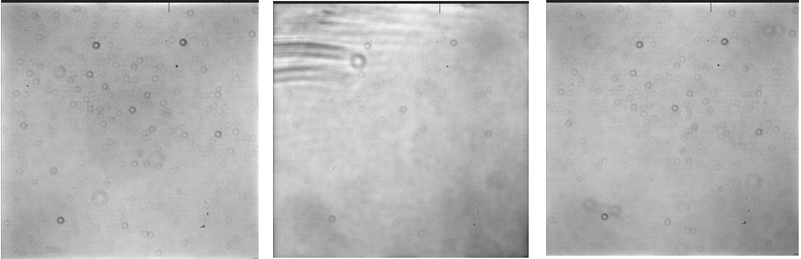
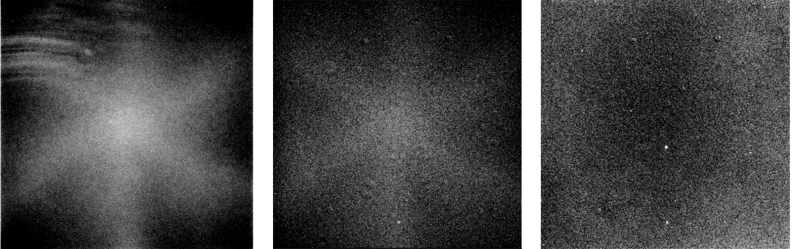
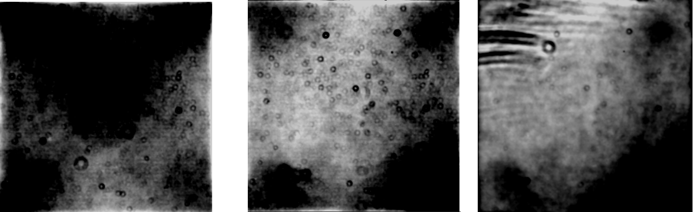
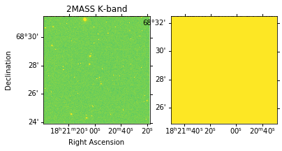
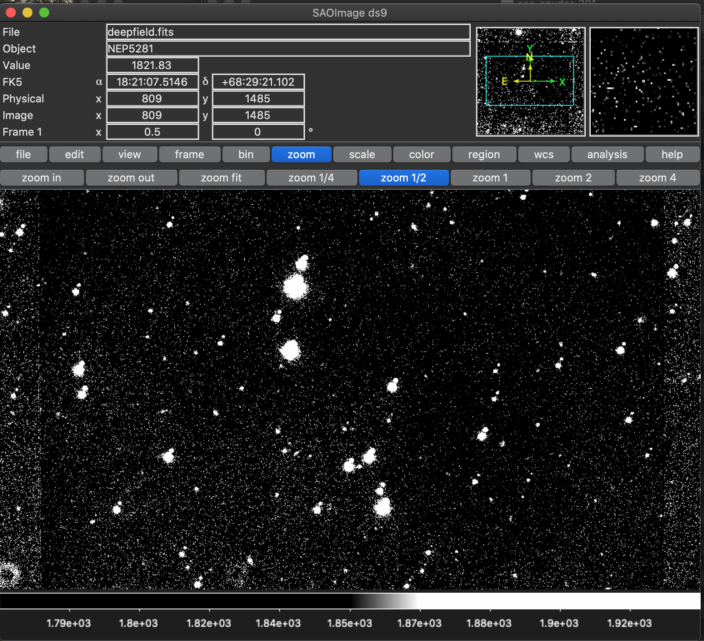

## 🔭 Reprojecting Astronomical Images! 🌠

###  👽 Overview

In Spring 2020, for Observation Astronomy (ASTR 301), my classmates and I were given a semester long project of processing and reprojecting astronomical images. Reprojecting image makes use of the `reproject` package by Thomas Robitaille (a man who writes a lot of helpful code for Astropy that I used in my undergrad). Reprojecting by difinition means re-gridding of images throuhg interpolation such as changing the pixel resolution, orientation, and coordinate system.  

### 🖥️ Technologies required 

- Astropy (reproject and reproject_interp), Matplotlib, WCS (the world coordinate system) packages; ds9 and SExtractor software

### 🌌 Data

- Astronomical images from UH Tek Telescope

### 🌜 How this works!

- The first step is to apply bias and overscan and trim the images, as done in `trim_overscan_bias.py`. The data taken in can be viewed in the folder 'UH88 Tek RAW DATA' directory. The output can be viewed in the 'Final median-combined Bias, Dome Flats, and Sky Flats' directory.

These three images, from left to right, are the final dome flats in r, z, and i filter respectively. Note that the donut rings are dust on the telescope lens.

These three images, from left to right, are the final sky flats in r', z', and i' filter respectively. Note that the star pattern is an effect of the lens opening for a very short exposure (caused by light having more time to saturate the center than the outside edges.)

These three images, from left to right, are the final filtered flats in r', z', and i' filter respectively.

- The next step was to solve and apply WCS (world coordinate system) and reproject using `reproject.py`. WCS corrected images can be found in 'Final WCS-corrected, combined r, i, z images of NEP5281'. Note, see deepfield below for a visual outcome of reproject.

- The next step was to use the software SExtractor in order to create .cat files. SExtractor is a Source Extractor software used for extracting catalogs of sources of astronomical images.

- The last step we did was to line fit and plot. View PDFs in directory 'Plots' to view process and plotted data.

### 📷 Overview of CCD Proccessing

## CCD 📸
- CCD stands for Charge Coupled Device which is converts images into digital signals. When you take a picture, light is relfected from the target and transmitted through the lens forming an image on the CCD of the camera. 

## Overscan 🎥
- 'How much signal is gernated by nothing (not the image tyring to capture) by the electronics of the camera itself'? Overscan is a correction for the bias produced extra pixels during readout of image. You take a zero second exposure with the shutter closed, where the output should be 0 across the board since no light could reach the CCD. Subtract the electronic noise of this exposure from the rest of your images to correct for Overscan.

## Bias 🕶️
- A dark current is the resulting signal from the running detector of telescope. To correct for this, take 10 bias frames, average htem, and remove from astronomical images. If pixels from the telescope are permanently on (give signal even when there is no light), you can create a mask that will ignore these pixels in future observations. Pixels may become damaged permanently by cosmic rays or bad manufacturing.

## Dome Flats 🌞
- The goal of correcting for Dome Flats is to get an even field of light by correcting for things such as dust ring donuts (see Dome Flats images in How This Works below), and any other uneven pixel responses by removing anything that impacts incoming light (scratches, etc.).

## Sky Flats 🌃
- Corrects for color changes of the dome between twilight and night sky; a systematic issue.

## WCS Corrections 🌍
- WCS is the world coordinate system which helps to ensure headers are proper for images to make sure location of objects in sky is clear.

## SExtractor Usage 🌠
- Given an astronomical image, the SExtractor software will give you astronomical objects based of user input of how bright a pixel needs to be and how many of these pixels together constitutes an object (these data points given based on how distant the images are, how bright the moon is the night of observation, etc.)

### 📚 Outcome

This is a repojection.

This is a deepfield image that has been processed! Screenshot taken of image processed via the code in this repo and viewed in the software ds9.

### 📔 The README I turned in with the project:

The beginning steps of the project were to trim and overscan correct images which was done via python in spyder. I used ccdproc to calculate the overscan to subtract from the pixel values and trim off the overscan. Next I created the median bias which was subtracted from the rest of the objects. After this, I created my sky flats and dome flats by creating filters and applying them to the images, creating the master bias flats. All of these were applied to the images in all of the filters. Fits files and code were uploaded to **Final median-combined Bias, Dome Flats, and Sky Flats folder**. Next was to solve and apply WCS which I did by using the 5 images in each filter. WCS, or world coordinate system, is used to make sure the headers are proper for images so that you know where in the sky things are. I used one fits file (0) as a reference for the header. The rest were reprojected using reproject_interp. Using arrays and footprints, the images were all reprojected. Then, the NaNs were fixed in an output file using fits.writeto. The reprojected images were then written to new files where I then combined all of them using ccdproc.combine. These steps were done for all three filters, then finally I combined all three master combine files for a deep field image. Note, in code is “print(“hello”) and print(“goodbye”)”. These were for my own personal reference to see where the code was at while it was running, and I decided to leave it in the code for a visualization of my process. Fits files, code used, and image created in ds9 uploaded to **Final WCS-corrected, combined r, i, z images of NEP5281 folder**. To run SExtractor, I downloaded the necessary files from the Google drive. I ran into numerous issues with this, as the software itself was hard to download and then I couldn’t understand what I had to do with it when I had it. I was able to figure it out with the help of the TA’s and multiple peers in class. With a helpful email from Caroline, I was able to run SExtractor using a config file on my files and get configuration files, checkimages files, and catalogs out. **Config file parameters were chosen by** examining what changed when they were adjusted. Back_size was reduced to give a more finely grained sample. Deblend_mincont was increased to help SExtractor not separate objects from their parts, such as a diffraction spike. Detect_minera was kept the same because increasing it gave too few sources and decreasing it gave too many sources. Note that only a single config file was used for all three filters. Catalogs uploaded to **Final SExtractor catalogs in r, i, z for NEP5281 folder**. Config file and checkimages uploaded to **SExtractor configuration files and the checkimages folder**. This was very exciting as I had been very frustrated throughout the process. Finally, the line fitting process, including calibration plots, zp and c calculations were done using the code provided by Miles Lucas. Code with plots uploaded to **Plots folder**. Note that all folder names (and parameters for SExtractor blurb) are bolded in this doc to give more guidance on the overall organization of my project. 